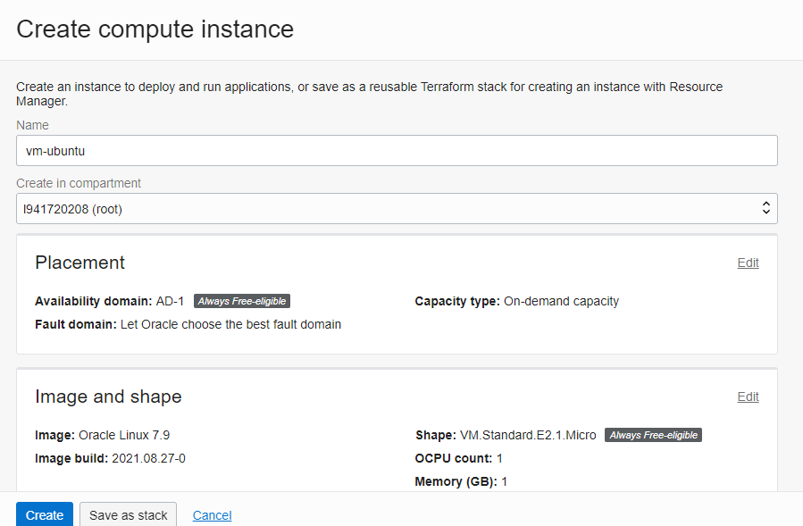
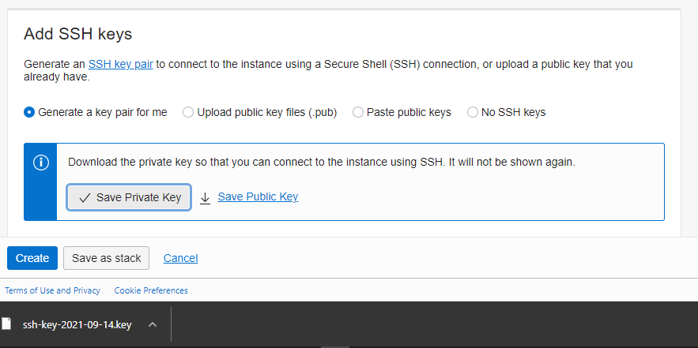
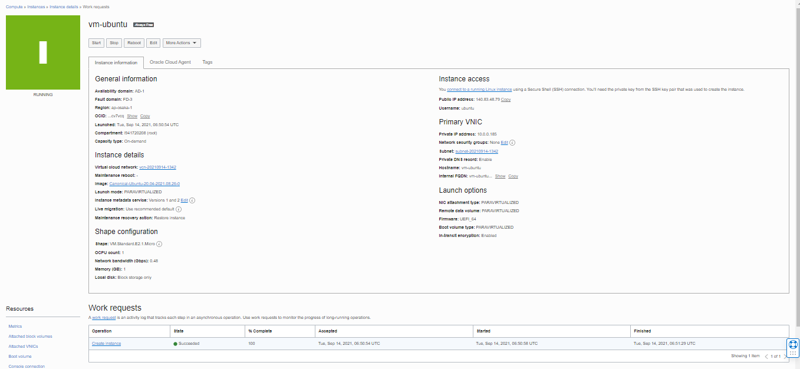

# 03 - Membuat Virtual Machine

## Tujuan Pembelajaran

1. Mengetahui layanan Oracle Cloud Infrastructure Compute
2. Mampu membuat Virtual Machine (VM) di layanan compute Oracle Cloud

## Hasil Praktikum

Berikut ini adalah bukti telah berhasil Membuat Virtual Machine.

[contoh link](../../src/01_pengantar/hello.js)
