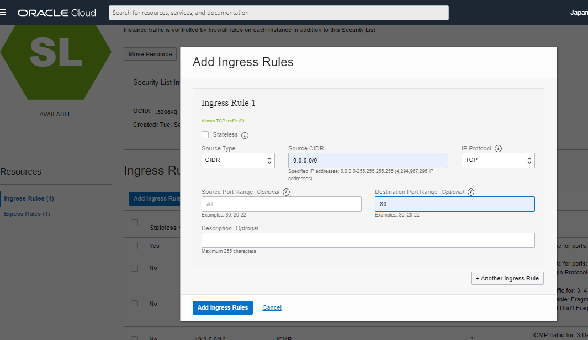

# 05 - Membuat Database

## Tujuan Pembelajaran

1. Mamahami PLATFORM AS A SERVICE (PAAS)
2. Mampu membuat Database mysql di oracle

## Hasil Praktikum

Berikut ini adalah bukti telah berhasil Membuat Database

