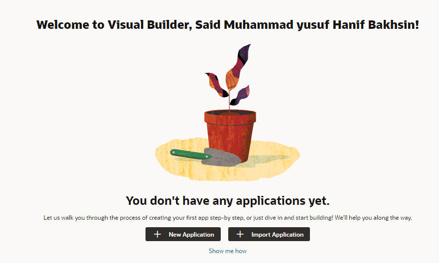
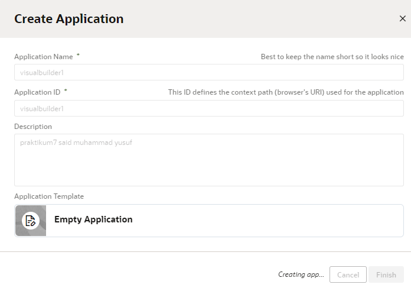
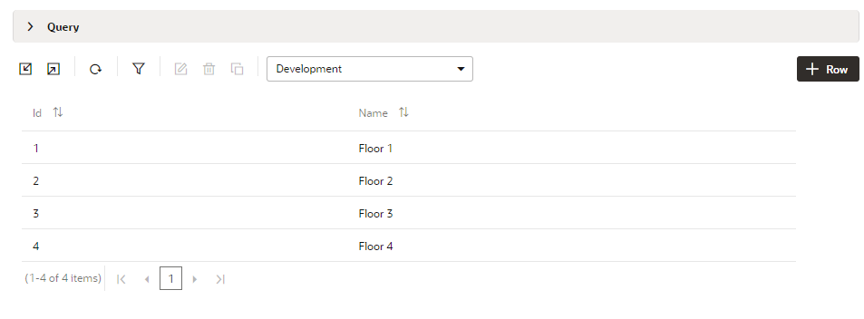

# 07 - Saas (software as a service)

## Tujuan Pembelajaran

1. Mengetahui layanan Oracle Cloud Infrasturcture Software as a Service.
2. Mampu mengguankan layanan software layanan oracle.

## Hasil Praktikum

Berikut ini adalah bukti telah berhasil Membuat Virtual Machine.

